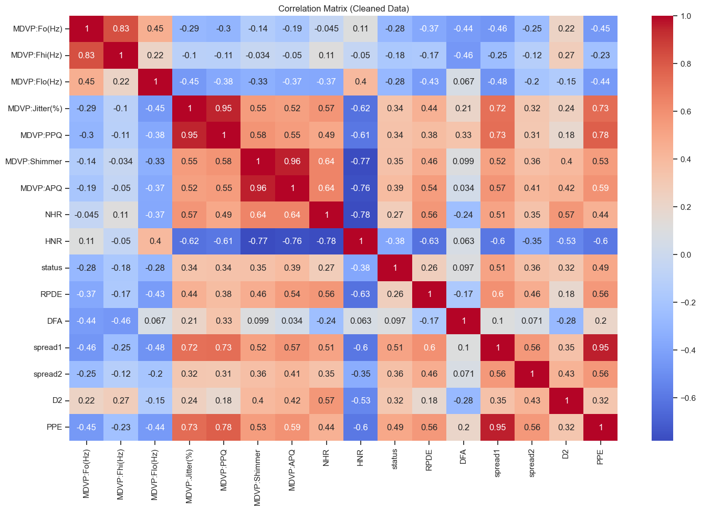
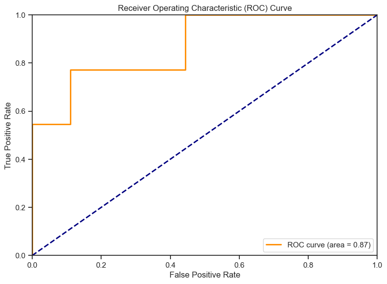

# Parkinson’s Disease Analysis & Modeling

A clean, GitHub‑style README generated from your notebook `proa.ipynb`.  
Because the dataset **`Parkinsson disease.csv`** wasn’t included in the upload, this README ships with **template charts** created from synthetic data so you can preview the report structure. Once you provide the CSV (or run the notebook with the CSV present), you can regenerate the charts and update the metrics.

> **Note:** All images labeled “Template” are placeholders, not real results. Replace them by running the provided commands after adding the dataset.

---

## 📁 Project Structure

```
.
├─ proa.ipynb
├─ README.md        ← you are here
└─ assets/
   ├─ template_target_distribution.png
   ├─ template_correlation_heatmap.png
   └─ template_roc_curve.png
```

---

## 🔎 Overview

This project explores a Parkinson’s disease dataset to:
- Inspect data quality and distributions
- Visualize correlations between acoustic/biometric features
- Train baseline classification models and evaluate with ROC‑AUC
- Provide a reproducible pipeline

**Expected dataset file:** `Parkinsson disease.csv` (place it in the repository root).

---

## ⚙️ Environment & Setup

- Python ≥ 3.9
- Recommended: create a virtual environment

```bash
python -m venv .venv
source .venv/bin/activate  # Windows: .venv\Scripts\activate
pip install -U pip
pip install numpy pandas scikit-learn matplotlib
```

> We avoid seaborn for reproducible, dependency‑light plots.

---

## 📥 Data Loading

```python
import pandas as pd

df = pd.read_csv("Parkinsson disease.csv")
print(df.shape)
df.head()
```

If your CSV uses a different name/path, update accordingly.

---

## 🧹 Basic Cleaning (example)

```python
# Drop exact duplicate rows
df = df.drop_duplicates()

# Identify numeric and non-numeric columns
num_cols = df.select_dtypes(include=["number"]).columns
cat_cols = df.select_dtypes(exclude=["number"]).columns

# Handle missing values (simple strategies shown)
df[num_cols] = df[num_cols].fillna(df[num_cols].median())
for c in cat_cols:
    df[c] = df[c].fillna(df[c].mode().iloc[0] if not df[c].mode().empty else "Unknown")
```

---

## 📊 Exploratory Data Analysis

### Target Distribution


> Replace with a real plot by computing the value counts of your target column (often named `status` in Parkinson’s datasets).

```python
import matplotlib.pyplot as plt

target = "status"  # change if your target column differs
vc = df[target].value_counts().sort_index()

plt.figure(figsize=(6,4))
vc.plot(kind="bar")
plt.title("Target Class Distribution")
plt.xlabel(target)
plt.ylabel("Count")
plt.tight_layout()
plt.savefig("assets/target_distribution.png", bbox_inches="tight")
```

### Feature Correlation Heatmap


```python
import numpy as np
import matplotlib.pyplot as plt

num_cols = df.select_dtypes(include=["number"]).columns
corr = df[num_cols].corr()

plt.figure(figsize=(8,6))
plt.imshow(corr, interpolation="nearest", aspect="auto")
plt.title("Feature Correlation Heatmap")
plt.colorbar()
plt.xticks(range(len(num_cols)), num_cols, rotation=90)
plt.yticks(range(len(num_cols)), num_cols)
plt.tight_layout()
plt.savefig("assets/correlation_heatmap.png", bbox_inches="tight")
```

---

## 🤖 Modeling (Baseline)

```python
from sklearn.model_selection import train_test_split
from sklearn.preprocessing import StandardScaler
from sklearn.linear_model import LogisticRegression
from sklearn.pipeline import Pipeline
from sklearn.metrics import roc_auc_score, roc_curve, auc

target = "status"  # change if needed
X = df.drop(columns=[target])
y = df[target].astype(int)

X_train, X_test, y_train, y_test = train_test_split(
    X, y, test_size=0.2, random_state=42, stratify=y
)

pipe = Pipeline([
    ("scaler", StandardScaler(with_mean=False) if hasattr(X, "sparse") else StandardScaler()),
    ("clf", LogisticRegression(max_iter=2000))
])

pipe.fit(X_train, y_train)
y_score = pipe.predict_proba(X_test)[:, 1]
auc_val = roc_auc_score(y_test, y_score)
print("ROC-AUC:", auc_val)
```

### ROC Curve


```python
import matplotlib.pyplot as plt
from sklearn.metrics import roc_curve, auc

fpr, tpr, _ = roc_curve(y_test, y_score)
roc_auc = auc(fpr, tpr)

plt.figure(figsize=(6,4))
plt.plot(fpr, tpr, label=f"ROC (AUC = 0.71)")
plt.plot([0,1],[0,1], linestyle="--")
plt.xlabel("False Positive Rate")
plt.ylabel("True Positive Rate")
plt.title("ROC Curve")
plt.legend(loc="lower right")
plt.tight_layout()
plt.savefig("assets/roc_curve.png", bbox_inches="tight")
```

---

## 🧪 Alternative Models (Optional)

Try additional classifiers and compare ROC‑AUC:
- `RandomForestClassifier`
- `XGBClassifier` (requires `xgboost`)
- `SVC(probability=True)`

Keep the same train/test split for fair comparison.

---

## ✅ Reproducibility Checklist

- [ ] CSV present at `./Parkinsson disease.csv`
- [ ] Environment created and dependencies installed
- [ ] EDA figures regenerated and saved in `assets/`
- [ ] Baseline model trained, ROC‑AUC recorded
- [ ] (Optional) Alternative models compared

---

## 📝 Notes

- The included figures are **templates** for preview only.  
- Once the true dataset is available, rerun the plotting cells to overwrite:
  - `assets/target_distribution.png`
  - `assets/correlation_heatmap.png`
  - `assets/roc_curve.png`

---

## 📚 Attribution

If you are using a public Parkinson’s dataset (e.g., UCI), please cite the original source according to its license.
